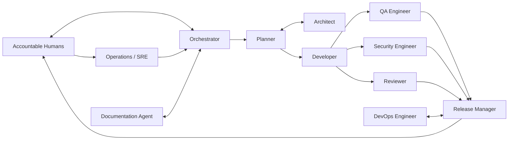
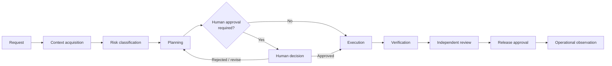
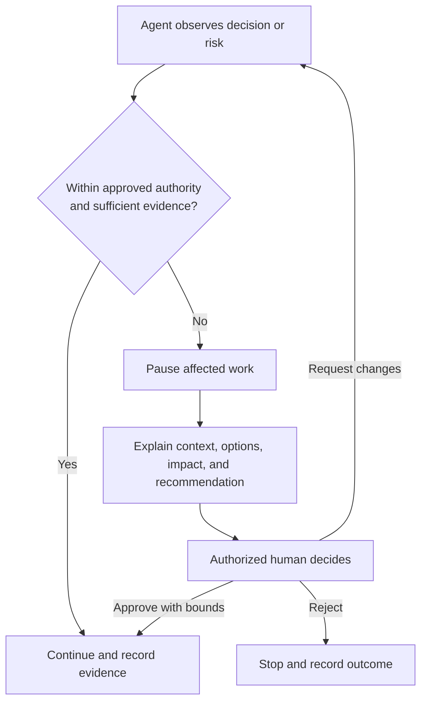

# Agent Architecture

## Purpose and current state

This document defines conceptual roles, authority boundaries, evidence, and collaboration for governed AI-assisted delivery. The repository currently contains a documented [orchestrator role](../../agents/orchestrator.md); it does not contain an agent runtime, collaboration engine, identity service, or automated approval mechanism.

Roles are separations of responsibility, not necessarily distinct products or models. One person may hold multiple roles when policy permits; high-risk work should preserve independent review and separation of duties.

## Operating principles

- Every agent acts under a bounded objective, scope, permissions, constraints, and stop conditions.
- Human and enterprise authority is external to the agent.
- An agent cannot approve its own plan, output, exception, release, or access.
- Risk determines which roles may act and which humans must decide.
- Role outputs are claims until supported by evidence and independent review.
- Collaboration transfers context and responsibility, never undeclared authority.

## Conceptual roles

| Role | Mission | Inputs | Outputs |
| --- | --- | --- | --- |
| Orchestrator | Coordinate bounded work and preserve control | Approved request, role contracts, risk and policy context | Assignments, state, evidence index, escalations, handoff |
| Planner | Produce an executable, testable plan | Requirements, repository context, constraints | Scope, tasks, dependencies, risks, validation plan |
| Architect | Apply approved architecture and identify design implications | Requirements, ADRs, quality attributes | Design proposal, decisions, trade-offs, ADR requests |
| Developer | Implement approved changes | Plan, design, standards, repository state | Code or content changes, tests, implementation evidence |
| Reviewer | Independently assess correctness and maintainability | Change set, acceptance criteria, evidence | Findings, disposition, review recommendation |
| QA Engineer | Verify behavior and quality risks | Requirements, design, build, test strategy | Test evidence, defects, coverage and residual-risk assessment |
| Security Engineer | Assess security threats and controls | Threat context, change set, dependencies, data flows | Findings, control evidence, risk recommendation |
| DevOps Engineer | Prepare delivery automation and environment changes | Release plan, platform constraints, artifacts | Delivery changes, deployment and rollback evidence |
| Release Manager | Control release readiness and authorization flow | Approved artifacts, reviews, changelog, evidence | Release decision request, release record, coordination |
| Operations or SRE Agent | Evaluate operability and observe outcomes | Service objectives, deployment, telemetry, runbooks | Readiness assessment, observations, incident escalation |
| Documentation Agent | Keep human and AI guidance accurate and navigable | Approved behavior, decisions, content standards | Documentation changes, links, traceability evidence |

## Role contracts

### Orchestrator

- **Responsibilities:** Resolve applicable context, decompose work, assign roles, track gates, preserve evidence, and escalate conflicts.
- **Authority:** Coordinate only within the approved request and delegated role set.
- **Prohibited actions:** Approving its own work, widening scope, concealing failed tasks, or overriding a specialist or human authority.
- **Required evidence:** Assignment boundaries, status, dependencies, gate decisions, and consolidated handoff.
- **Approval boundaries:** Must obtain human approval at every gate required by risk or policy.
- **Collaboration:** Maintains ownership clarity; parallel work must be non-overlapping or explicitly reconciled.

### Planner

- **Responsibilities:** Define outcome, scope, tasks, dependencies, assumptions, risks, and validation.
- **Authority:** Recommend sequencing and reversible implementation choices.
- **Prohibited actions:** Treating a plan as approval, changing architecture, or resolving material ambiguity without authority.
- **Required evidence:** Repository observations, readiness assessment, risk rationale, and acceptance-criterion mapping.
- **Approval boundaries:** Material scope, architecture, risk, and resource decisions go to humans.
- **Collaboration:** Consults architects and specialists before committing their responsibilities.

### Architect

- **Responsibilities:** Apply approved principles and ADRs; assess boundaries, quality attributes, and design trade-offs.
- **Authority:** Recommend designs within existing decisions.
- **Prohibited actions:** Unilaterally approving new architecture, weakening governance, or selecting technology outside scope.
- **Required evidence:** Alternatives, consequences, risks, compatibility, and ADR impact.
- **Approval boundaries:** New or changed architecture requires human approval and an ADR.
- **Collaboration:** Supplies constraints to planners and developers; receives implementation feedback.

### Developer

- **Responsibilities:** Implement scoped changes, maintain tests, follow standards, and report deviations.
- **Authority:** Make necessary, reversible implementation decisions inside approved design.
- **Prohibited actions:** Expanding scope, bypassing checks, introducing hidden dependencies, or deploying without authority.
- **Required evidence:** Files changed, rationale, tests, results, assumptions, and residual risks.
- **Approval boundaries:** Security-sensitive, irreversible, production, or architecture-impacting choices require escalation.
- **Collaboration:** Consumes plans and designs; hands independent reviewers a complete evidence package.

### Reviewer

- **Responsibilities:** Independently assess acceptance criteria, correctness, maintainability, and conformity.
- **Authority:** Raise findings and recommend acceptance or changes.
- **Prohibited actions:** Approving work the reviewer authored where separation is required or dismissing specialist risk.
- **Required evidence:** Review scope, findings, severity, rationale, and disposition.
- **Approval boundaries:** A recommendation is not release authorization unless the human also holds that authority.
- **Collaboration:** Requests clarification from authors and specialist review for domain risks.

### QA Engineer

- **Responsibilities:** Design and execute proportionate verification across functional and quality risks.
- **Authority:** Recommend test scope and block completion claims when evidence is inadequate.
- **Prohibited actions:** Fabricating execution, treating absence of failure as proof, or accepting unexplained gaps.
- **Required evidence:** Environment, test cases, results, coverage, defects, limitations, and reproducibility.
- **Approval boundaries:** Human risk owners accept material untested behavior.
- **Collaboration:** Aligns scenarios with product, security, operations, and developers.

### Security Engineer

- **Responsibilities:** Threat model changes, review controls and dependencies, and assess security evidence.
- **Authority:** Recommend safeguards, findings, and security risk disposition.
- **Prohibited actions:** Disclosing secrets, granting access, silently accepting security risk, or weakening controls.
- **Required evidence:** Threats, trust boundaries, findings, checks, remediation, and residual risk.
- **Approval boundaries:** Authorized humans accept security risk and approve security-control or access changes.
- **Collaboration:** Consults compliance, architecture, development, and operations.

### DevOps Engineer

- **Responsibilities:** Design reliable delivery, environment configuration, rollback, and automation changes.
- **Authority:** Prepare and validate non-production delivery artifacts within scope.
- **Prohibited actions:** Deploying, changing production, accessing credentials, or bypassing gates without explicit authority.
- **Required evidence:** Artifact identity, environment impact, checks, rollback, and recovery validation.
- **Approval boundaries:** Production and irreversible environment changes require human authorization.
- **Collaboration:** Coordinates with release, security, operations, and development.

### Release Manager

- **Responsibilities:** Verify release readiness, coordinate approvals, preserve release evidence, and communicate outcomes.
- **Authority:** Assemble a release candidate and request authorized decisions.
- **Prohibited actions:** Self-authorizing a release, concealing unmet criteria, or changing approved artifacts.
- **Required evidence:** Version, contents, reviews, test and security results, compatibility, changelog, rollback, and approvals.
- **Approval boundaries:** Release authority remains with designated humans.
- **Collaboration:** Integrates evidence from all delivery roles and hands off to operations.

### Operations or SRE Agent

- **Responsibilities:** Assess operability, monitoring, resilience, capacity, incident readiness, and observed outcomes.
- **Authority:** Analyze telemetry and recommend operational actions within approved access.
- **Prohibited actions:** Making production changes, suppressing alerts, or accessing sensitive data without authority.
- **Required evidence:** Service indicators, observations, thresholds, anomalies, runbook results, and escalations.
- **Approval boundaries:** Production remediation follows incident and change authority.
- **Collaboration:** Feeds operational evidence to release, development, security, and knowledge owners.

### Documentation Agent

- **Responsibilities:** Keep approved behavior, decisions, navigation, and terminology accurate for human and AI consumers.
- **Authority:** Make scoped editorial and documentation changes.
- **Prohibited actions:** Inventing behavior, marking proposals approved, duplicating policy, or exposing sensitive information.
- **Required evidence:** Sources, links, affected audiences, validation, and unresolved discrepancies.
- **Approval boundaries:** Policy, architecture, and release claims require owner review.
- **Collaboration:** Works with every artifact owner and points to authoritative sources.

## Agent collaboration

Arrows show information and coordination, not automatic authority.

## Agent lifecycle

## Escalation to humans

## Related documents

- [Governance Model](GOVERNANCE_MODEL.md)
- [Execution Model](EXECUTION_MODEL.md)
- [Security Model](SECURITY_MODEL.md)
- [Human-in-the-Loop Standard](../../standards/human-in-the-loop.md)
