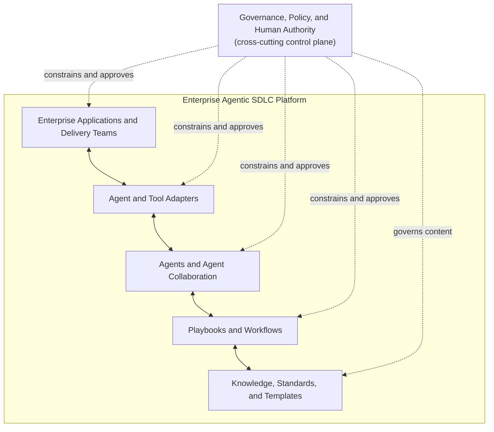

# Framework Architecture

## Executive summary

The Enterprise Agentic SDLC Framework is a vendor-neutral set of governance, knowledge, collaboration, and execution contracts for responsible AI-assisted software delivery. Its architecture separates enduring enterprise authority and engineering guidance from replaceable agents, tools, and delivery platforms.

The repository implements the knowledge and governance layer as Markdown artifacts and the REL-004 read-only [validation framework](../../tools/validation/README.md). The validation framework provides a centralized registry, common result and severity contracts, JSON evidence, repository conformance checks, and GitHub Actions execution. A broader CLI, plugin loading, adapters, and orchestration remain future-state concepts; this document defines boundaries for their eventual design without claiming they exist.

## Context and problem statement

Delivery organizations need AI systems to apply approved knowledge, cooperate across roles, and produce evidence without gaining unbounded authority. A useful architecture must support different vendors and technology stacks, preserve organizational policy, and remain understandable before any runtime is introduced.

## Goals

- Establish clear layers, ownership boundaries, and information flow.
- Make governance cross-cutting and enforce human authority.
- Support human-readable and AI-consumable knowledge.
- Define stable extension points for future adapters and plugins.
- Enable incremental evolution from documentation to validated tooling and governed execution.
- Preserve traceability from request through evidence and operational feedback.

## Non-goals

- Selecting an AI model, cloud, programming language, database, or delivery platform
- Specifying an implementation architecture for a future runtime or CLI
- Automating approvals or replacing accountable enterprise roles
- Defining technology-specific practices in the shared core
- Guaranteeing outcomes solely through documentation

## Design principles

1. Human-approved governance applies to every layer.
2. Agents receive bounded objectives, context, permissions, and stop conditions.
3. Shared contracts remain vendor- and technology-neutral.
4. Authoritative knowledge is structured once and referenced elsewhere.
5. Risk determines autonomy, evidence, and approval depth.
6. Future automation must conform to published contracts.
7. Proposed capabilities must not be presented as current features.
8. Components should be independently adoptable and replaceable.

## Platform layers

Governance is shown as a cross-cutting control plane rather than a passive bottom layer.

### Enterprise Applications and Delivery Teams

People, repositories, delivery systems, and operating environments in which work originates and outcomes are consumed. Enterprise owners retain accountability.

### Agent and Tool Adapters

Planned integration boundaries that translate stable framework contracts into vendor- or tool-specific interactions. Adapters may not redefine policy or increase authority.

### Agents and Agent Collaboration

Bounded roles that plan, implement, review, validate, release, and observe work. The [agent architecture](AGENT_ARCHITECTURE.md) defines their responsibilities and separation of duties.

### Playbooks and Workflows

Task-specific coordination and procedural guidance. They assemble standards and knowledge for a delivery outcome without becoming a competing policy source.

### Knowledge, Standards, and Templates

Structured, reusable content for humans and machines. Standards are mandatory within their scope; knowledge explains implementation choices; templates provide non-authoritative starting points.

### Governance, Policy, and Human Authority

Cross-cutting controls for risk, access, decisions, approvals, evidence, exceptions, and accountability. Enterprise policy remains superior to repository guidance.

## Core components

| Component | Responsibility | Current state |
| --- | --- | --- |
| Governance standards | Define readiness, completion, risk, and human oversight | Initial documents exist |
| Knowledge modules | Provide structured reusable guidance | Initial bounded-autonomy module exists; model proposed |
| Agent definitions | Bound role authority and evidence | Initial orchestrator exists; catalog proposed |
| Playbooks and workflows | Coordinate repeatable work | Initial feature and analysis content exists |
| Templates and examples | Provide reusable non-authoritative artifacts | Planned |
| Plugins | Package technology-specific extensions | Proposed concept only |
| Adapters | Connect vendors and engineering tools | Planned |
| Validation tooling | Check metadata, schema, IDs, structure, links, relationships, catalog and product traceability, defined lifecycle rules, and repository hygiene | Implemented for REL-004 with JSON evidence and CI execution; documented limitations remain |
| Orchestration | Coordinate bounded execution and approvals | Planned |

## Information flow

1. A human or approved system supplies a request and enterprise context.
2. Applicable governance, standards, architecture decisions, workflows, and knowledge are resolved by precedence.
3. Risk classification establishes authority, evidence, and approval checkpoints.
4. Humans approve consequential plans and actions where required.
5. Authorized participants execute bounded work.
6. Independent checks produce evidence.
7. Authorized humans decide release or production actions.
8. Operational outcomes and feedback inform future approved knowledge changes.

The [execution model](EXECUTION_MODEL.md) defines this lifecycle in detail.

## Human approval boundaries

Agents cannot grant themselves approval or infer approval from silence. Explicit human approval is mandatory for high and critical risk, production changes, destructive or irreversible actions, security and identity changes, sensitive-data decisions, policy exceptions, releases where organizational policy requires them, and any work with conflicting requirements or insufficient evidence.

## Extension model

The core is extended through:

- instruction files and future adapters for tool-specific behavior;
- structured knowledge and standards for approved guidance;
- playbooks and workflows for task-specific coordination;
- proposed plugins for cohesive technology capabilities.

Extensions must declare identity, ownership, compatibility, dependencies, security implications, and conflicts. See the [plugin model](PLUGIN_MODEL.md).

## Repository model

The repository separates authoritative policy, reusable knowledge, role definitions, procedures, examples, tools, and decision records. The target layout and incremental migration rules are defined in [Repository Structure](REPOSITORY_STRUCTURE.md).

## Current state

Version `0.2.0` remains a proposed architecture blueprint layered on the Markdown knowledge and governance foundation. REL-004 adds an executable, dependency-free Python validation framework and CI conformance workflow without introducing a broader framework CLI, plugin runtime, plugin manifest schema, adapter runtime, orchestration engine, or release automation. Detailed validator behavior and limitations are maintained in the [validation documentation](../../tools/validation/README.md).

## Future state

Subject to approved ADRs and incremental delivery, the framework may add:

- shared repository indexing and more targeted validation execution as scale warrants;
- search and indexing of structured knowledge;
- packaging and compatibility checks for plugins;
- vendor-specific adapters behind neutral contracts;
- governed orchestration with identity, approvals, evidence, and audit integration;
- reference implementations demonstrating conformance.

## Key architectural risks

| Risk | Architectural response |
| --- | --- |
| Policy fragmentation | Explicit precedence and single authoritative sources |
| Vendor coupling | Neutral core with adapters and plugins at boundaries |
| Excessive agent authority | Bounded roles, least privilege, stop conditions, human gates |
| Stale or conflicting knowledge | Stable ownership, review status, versioning, supersession |
| Unsafe extensions | Trust levels, declarations, validation, isolation, explicit approval |
| Documentation-runtime drift | Contracts, conformance checks, release evidence |
| False capability claims | Current/future state labels and review requirements |

## Related architecture documents

- [Repository Structure](REPOSITORY_STRUCTURE.md)
- [Knowledge Model](KNOWLEDGE_MODEL.md)
- [Plugin Model](PLUGIN_MODEL.md)
- [Agent Architecture](AGENT_ARCHITECTURE.md)
- [Governance Model](GOVERNANCE_MODEL.md)
- [Execution Model](EXECUTION_MODEL.md)
- [Security Model](SECURITY_MODEL.md)
- [Release Model](RELEASE_MODEL.md)

## Related ADRs

- [ADR-0002: Framework Architecture](../adr/ADR-0002-framework-architecture.md)
- [ADR-0003: Vendor-Neutral Core](../adr/ADR-0003-vendor-neutral-core.md)
- [ADR-0004: Plugin Extension Model](../adr/ADR-0004-plugin-extension-model.md)
- [ADR-0005: Structured Knowledge Modules](../adr/ADR-0005-structured-knowledge-modules.md)
