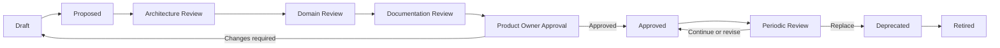

# Standards Review Process

## Purpose

This process governs creation, approval, maintenance, exception, deprecation, and retirement of Enterprise AI SDLC standards. It preserves accountable human decisions and evidence throughout the lifecycle.

## Lifecycle

Additional Security Review occurs before Product Owner Approval when a standard affects security, privacy, identity, access, sensitive data, supply chain, or compliance.

Statuses in metadata remain `Draft`, `Proposed`, `Approved`, `Deprecated`, or `Retired`. Architecture, domain, security, documentation, and Product Owner reviews are recorded gates, not additional metadata status values.

## Roles and responsibilities

| Role | Responsibilities | Approval authority |
| --- | --- | --- |
| Author | Draft content, research sources, resolve feedback, and assemble evidence | May propose; cannot approve own standard |
| Framework PMO | Confirm scope, IDs, ownership, release alignment, review routing, and records | May accept work into review; cannot replace Product Owner approval |
| Domain Reviewer | Assess technical correctness, practicality, evidence, and applicability | Recommends approval or changes for the domain |
| Enterprise Architect | Review boundaries, consistency, precedence, dependencies, and vendor neutrality | Required architecture gate for new or materially changed standards |
| Security Reviewer | Review threats, controls, sensitive data, access, and compliance impact where applicable | Required specialist gate for security-impacting content |
| Documentation Reviewer | Review structure, clarity, accessibility, metadata, links, terminology, and duplication | Required documentation gate |
| Product Owner | Confirm product value, scope, readiness, review evidence, and residual risk | Retains final approval authority |

AI agents MAY assist with drafting, analysis, link checking, and evidence assembly. They MUST NOT act as an approving role, accept risk, approve exceptions, or mark `human_review_required` false to bypass review.

## Review criteria

Reviewers assess:

- **Business relevance:** The standard supports an identified enterprise outcome and scope.
- **Technical correctness:** Rules reflect defensible engineering practice and reviewed sources.
- **Enforceability:** Mandatory rules have accountable subjects and clear conditions.
- **Testability:** Rules can be checked automatically or by repeatable human review.
- **Evidence:** Required evidence is proportionate, attributable, and sufficient.
- **AI guidance:** Agent permissions, validation, uncertainty, and stop conditions are bounded.
- **Human accountability:** Decisions, approvals, exceptions, and risk ownership remain human.
- **Vendor neutrality:** Shared requirements describe capabilities and outcomes.
- **Cross-reference accuracy:** IDs, links, direction, status, and precedence are correct.
- **Duplication and contradictions:** The standard has one authoritative concern and does not conflict with higher authority or peers.

## Approval requirements

A standard becomes Approved only when:

1. metadata validates against the approved schema;
2. author self-review is complete;
3. required architecture, domain, security, and documentation reviews are recorded;
4. findings are resolved or explicitly accepted by an authorized human;
5. cross-references and catalog entry are current;
6. the Product Owner records final approval.

Approval records identify the standard ID and version, reviewers, decision, conditions, date, evidence, and residual risk. Silence, elapsed time, tool success, or an agent recommendation is not approval.

## Exceptions

An exception request includes:

- standard ID, version, and affected rules;
- business need and bounded scope;
- risk and impact assessment;
- compensating controls and validation;
- accountable owner and authorized approver;
- start, expiry, review date, and remediation plan.

The standard owner, relevant domain and risk reviewers, and Product Owner review material exceptions. Organization policy may require additional authority. Exceptions are time-bound, auditable, not precedent, and never approved by an AI agent.

## Emergency changes

Emergency changes MAY use an expedited review when delay creates greater material risk. The Framework PMO records the emergency, scope, authority, minimum evidence, and reason normal sequencing cannot be followed. A designated human authority approves the temporary action. Architecture, security, documentation, and Product Owner retrospective review occurs within the period set by organizational policy.

Emergency status does not authorize self-approval, undocumented changes, secret exposure, or bypass of enterprise policy.

## Periodic review

The metadata `review_cycle` defines the maximum review interval or event trigger. Reviews also occur when:

- law, policy, threat, architecture, or operating context changes;
- a material exception, incident, or implementation failure exposes a gap;
- related assets become incompatible;
- the owner, scope, or evidence model changes.

The owner confirms continued relevance, correctness, enforceability, links, dependencies, evidence, exceptions, and lifecycle status.

## Change classification and versions

- **Patch:** Editorial corrections and non-breaking clarification; required reviewers confirm meaning is unchanged.
- **Minor:** Backward-compatible rules, sections, or evidence; domain and documentation review are required.
- **Major:** Removed, weakened, reinterpreted, or incompatible requirements; full review and migration guidance are required.

Pre-`1.0` changes still document compatibility and use the same review discipline. Status-only changes record a revision and approval evidence.

## Deprecation

Deprecation records the reason, replacement, migration steps, affected consumers, support window, owner, and intended retirement. The catalog retains the standard and labels it Deprecated. A replacement uses `supersedes` only after it exists and the relationship is approved.

## Retirement

Retirement ends active applicability but preserves the stable ID, historical content, decisions, exceptions, and replacement links. Consumers must migrate or obtain a separately authorized exception before the retirement date.

## Replacement and supersession

A replacement:

1. receives its own stable ID unless it is a compatible version of the same standard;
2. identifies standards it supersedes;
3. documents compatibility and migration;
4. updates consumers and catalog relationships;
5. completes required review before the older standard is retired.

## Required records and evidence

The review package includes:

- request, owner, scope, and acceptance criteria;
- standard content and metadata;
- source references and design rationale;
- validation results and unresolved limitations;
- architecture, domain, security, and documentation findings;
- cross-reference and duplication review;
- exception and compatibility impact;
- Product Owner decision;
- version, changelog, catalog, and effective-date updates.

Records follow enterprise retention and sensitive-data requirements.

## Conflict and escalation

Conflicts with policy, architecture, other standards, or reviewer authority stop approval. The Framework PMO routes the conflict to the accountable policy owner, Enterprise Architect, domain authority, security or compliance owner, and Product Owner as applicable. The least restrictive interpretation is never selected by default.

## Related documents

- [Human-in-the-Loop Standard](../../standards/human-in-the-loop.md)
- [Risk Classification Standard](../../standards/risk-classification.md)
- [Governance Model](../architecture/GOVERNANCE_MODEL.md)
- [Standard Authoring Guide](../standards/STANDARD_AUTHORING_GUIDE.md)
- [Cross-Reference Model](../architecture/CROSS_REFERENCE_MODEL.md)
